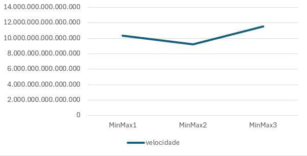
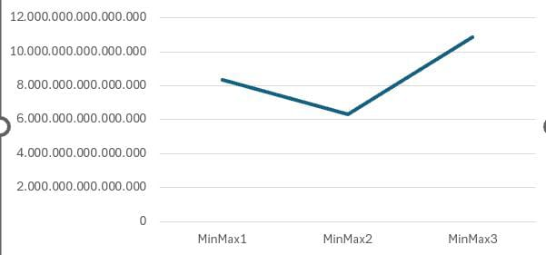
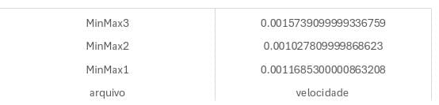
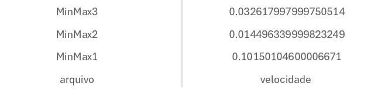

# Comparação de Funções `minmax`

me chamo luis Otávio 
Os testes foi realizado em um dispositivo móvel
# minMax1 
```python
def minmax(a):
  _max = a[0]
  _min = a[0]
  for i in range(len(a)):
    if a[i] > _max:
      _max = a[i]
    if a[i] < _min:
      _min = a [i]
```
# complexidade de tempo 
a complexidade de tempo é de n por que o loop executa n-1

# minMax2

```python
def minmax(a):
    _min = a[0]
    _max = a[0]
    for i in range(len(a)):
        if a[i] > _max:
            _max = a[i]
        elif a[i] < _min:
            _min = a[i]
```
# complexidade de tempo 
a complexidade de tempo e de 2n ja quê 


1. O loop que preenche a lista com números aleatórios executa n operações
2. O loop que encontra o máximo e o mínimo executa n-1 operações

e a gente tira o n-1 ja que e aritmética 
#minMax 3
```python
def minmax(a):
  n = len(a)
  if n % 2 != 0:
    a.append(a[-1])
    b = n -1
  else:
    b = n -1
  _min = a[1]
  _max = a[1]
  if a[0] > a[1]:
    _min, _max = a[0], a[1]
  i = 2
  while i <= b:
    if a[i] > a[i+1]:
      _max = a[i]
    if a[i+1] < _min:
      _min = a[i + 1]
    else: 
      if a[i] < _min:
        _min = a[1]
      if a[i+1] > _max:
       _max = a[i+1]
    i += 2
```
# complexidade de tempo 
a complexidade de tempo desse codigo e de 1.5n
1. O loop preenche a lista com numeros aleatórios executando n vezes
2. O loop que encontra o maximo e o minimo e executa n/2
3. entao 3n/2 = 1.5n

# rodar o codigo todo junto e contar o time do começo fim e caucular o tempo de execução 

```python
from minMax1 import minmax as m1
from minMax2 import minmax as m2
from minMax3 import minmax as m3

import timeit
import random

tempo = {"m1": [], "m2": [], "m3": []}

def criar_vetor(k):
   lista = list()
   for i in range(k):
      lista.append(random.randint(-16000, 16000))
   return lista

for i in [10, 100, 1000, 10000, 100000, 1000000, 10000000]:
   vetor = criar_vetor(i)
   t_m1 = timeit.timeit(lambda: m1(vetor), number=1)
   t_m2 = timeit.timeit(lambda: m2(vetor), number=1)
   t_m3 = timeit.timeit(lambda: m3(vetor), number=1)
   tempo["m1"].append(t_m1)
   tempo["m2"].append(t_m2)
   tempo["m3"].append(t_m3)

print(tempo)
```






